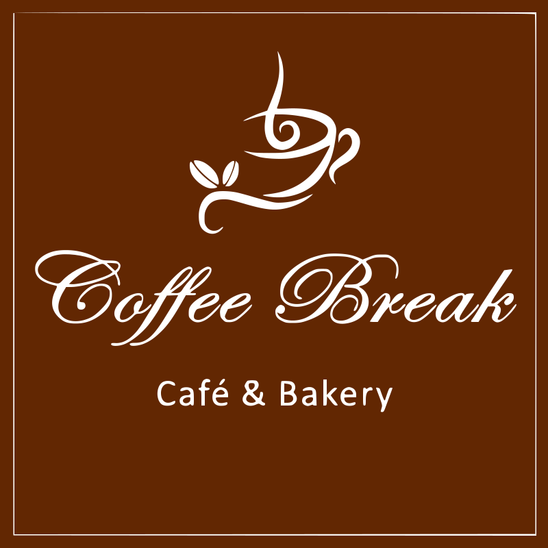

<!-- PROJECT LOGO -->
<p align="center">
  <a href="https://github.com/ArnabBiswas2303/Coffee-Break-Frontend">
    
  </a>

  <h3 align="center">Coffee Break Client</h3>

  <p align="center">
      Client Application For Coffee Break
  </p>
</p>
<!-- BADGES -->

<p align="center">
  
  
    
  
    
</p>
<br />

<!-- TABLE OF CONTENTS -->
<details open="open">
  <summary>Table of Contents</summary>
  <ol>
    <li>
      <a href="#about-the-project">About The Project</a>
      <ul>
        <li><a href="#built-with">Built With</a></li>
      </ul>
    </li>
    <li>
      <a href="#getting-started">Getting Started</a>
      <ul>
        <li><a href="#prerequisites">Prerequisites</a></li>
        <li><a href="#installation">Installation</a></li>
      </ul>
    </li>
    <li><a href="#contributing">Contributing</a></li>
    <li><a href="#license">License</a></li>
    <li><a href="#contact">Contact</a></li>
  </ol>
</details>

<!-- ABOUT THE PROJECT -->

## About The Project

This project is project developed for coffee break sikkim. The client side application is opensourced so as to inspire others to make amazing react applications.

### Built With

- [React](https://reactjs.org/)
- [Node](https://nodejs.org/en/)
- [React Spring](https://www.react-spring.io/)

<!-- GETTING STARTED -->

## Getting Started

To get a local copy up and running follow these simple example steps.

### Prerequisites

- npm
  ```sh
  npm install npm@latest -g
  ```

### Installation

1. Fork the repo
2. Clone the repo
   ```sh
   git clone https://github.com/ArnabBiswas2303/Coffee-Break-Frontend.git
   ```
3. Install NPM packages
   ```sh
   npm install
   ```
4. Run Dev Server
   ```sh
   npm run
   ```
   Go to `localhost:3000` to view the app.

<!-- CONTRIBUTING -->

## Contributing

Contributions are what make the open source community such an amazing place to be learn, inspire, and create. Any contributions you make are **greatly appreciated**.

1. Fork the Project
2. Create your Branch (`git checkout -b Component`)
3. Commit your Changes (`git commit -m 'Add Component'`)
4. Push to the Branch (`git push origin Component`)
5. Open a Pull Request

View [CONTRIBUTING.md](CONTRIBUTING.md) to learn about the style guide, folder structure, scripts, and how to contribute.

<!-- LICENSE -->

## License

Distributed under the MIT License. See `LICENSE` for more information.

<!-- CONTACT -->

## Contact

Arnab Biswas - [LinkedIn](https://www.linkedin.com/in/arnab-biswas-2303/)
